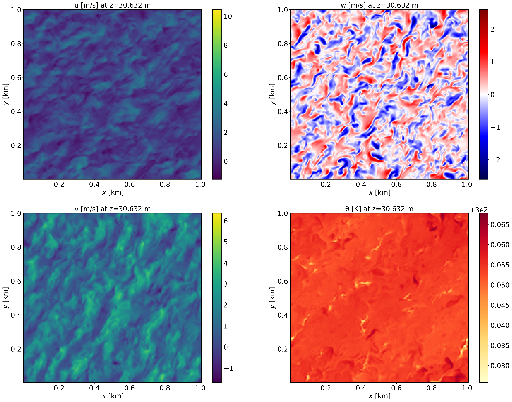
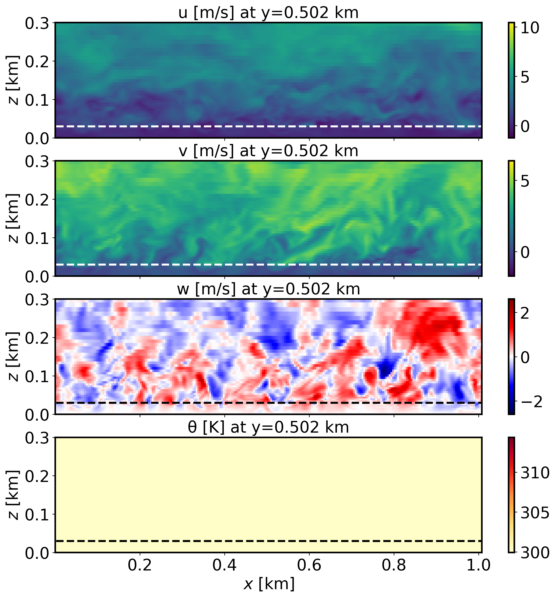
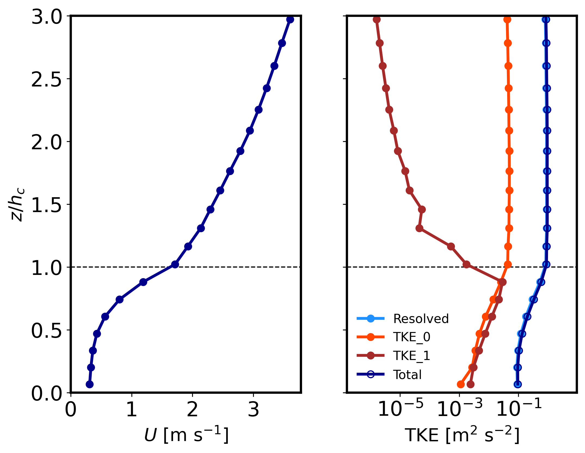

=================================================
Boundary layer in the presence of resolved canopy
=================================================

Background
----------

This is an idealized scenario of a neutrally stratified boundary layer in the presence of a horizontally homogeneous canopy. This case utilizes a two-equation canopy model (Shaw and Scumann, 1992; Shaw and Patton, 2003).

Input parameters
----------------

* Number of grid points: :math:`[N_x,N_y,N_z]=[252,250,90]`
* Isotropic grid spacings in the horizontal directions: :math:`[dx,dy]=[4,4]` m, vertical grid is :math:`dz=4` m at the surface and stretched with verticalDeformFactor :math:`=0.25`
* Domain size: :math:`[1.0 \times 1.0 \times 1.44]` km
* Model time step: :math:`0.01` s
* Advection scheme: 5th-order upwind
* Time scheme: 3rd-order Runge Kutta
* Geostrophic wind: :math:`[U_g,V_g]=[10,0]` m/s
* Latitude: :math:`54.0^{\circ}` N
* Surface potential temperature: :math:`300` K
* Potential temperature profile:

.. math::
  \partial{\theta}/\partial z =
    \begin{cases}
      0 & \text{if $z$ $\le$ 500 m}\\
      0.08 & \text{if 500 m < $z$ $\le$ 650 m}\\
      0.003 & \text{if $z$ > 650 m}
    \end{cases} 

* Surface heat flux:  :math:`0.0` Km/s
* Surface roughness length: :math:`z_0=1e-12` m
* Rayleigh damping layer: uppermost :math:`600` m of the domain
* Initial perturbations: :math:`\pm 0.25` K 
* Depth of perturbations: :math:`375` m
* Top boundary condition: free slip
* Lateral boundary conditions: periodic
* Time period: :math:`4` h

Execute FastEddy
----------------

Note that this example requires specification of a leaf area density (LAD) profile. A Jupyer notebook is provided in /tutorial/notebooks/Canopy_Prep.ipynb that reads in an LAD profile in .csv format (tape archive file at ZENODO blah blah blah!!!) and uses a FastEddy initial condition file to create a new initial condition file that includes de LAD information (CanopyLAD array). The notebook expects a canopy height value to be specified (:math:`h_c`), and that is currently set to 30.0 m. Run FastEddy using the input parameters file /tutorials/examples/Example05_CANOPY.in first for 1 timestep to create the FE_CANOPY.0 file, and then run the Jupyter notebook to modify the CanopyLAD array to include the LAD profile instead of the initialized all zeros. Then, run FastEddy for the :math:`4` h of the simulation. To execute FastEddy, follow the instructions `here`_.

.. _here: https://github.com/NCAR/FastEddy-model/blob/main_v2.0/README.md

Visualize the output
--------------------

Open the Jupyter notebook entitled "MAKE_FE_TUTORIAL_PLOTS.ipynb" and execute it using setting: case = 'canopy'.

XY-plane views of instantaneous velocity components at :math:`t=4` h (FE_CANOPY.1440000):

  
XZ-plane views of instantaneous velocity components at :math:`t=4` h (FE_CANOPY.1440000):

  
Mean (domain horizontal average) vertical profiles of wind speed at :math:`t=4` h (FE_CANOPY.1440000) and horizontally-averaged vertical profiles of turbulence quantities at :math:`t=3-4` h [perturbations are computed at each time instance from horizontal-slab means, then averaged horitontally and over the previous 1-hour mean]. Note that TKE_0 and TKE_1 correspond to the grid and wake-scale SGS TKE components.

Analyze the output
------------------

* Using the XY and XZ cross sections, discuss the characteristics (scale and magnitude) of the resolved turbulence.
* How does the vertical wind speed profile shape differ from the log-law?
* Using the vertical TKE profiles, discuss how well-resolved are these LES results and the regions where the SGS content of both TKE scales is most relevant.

