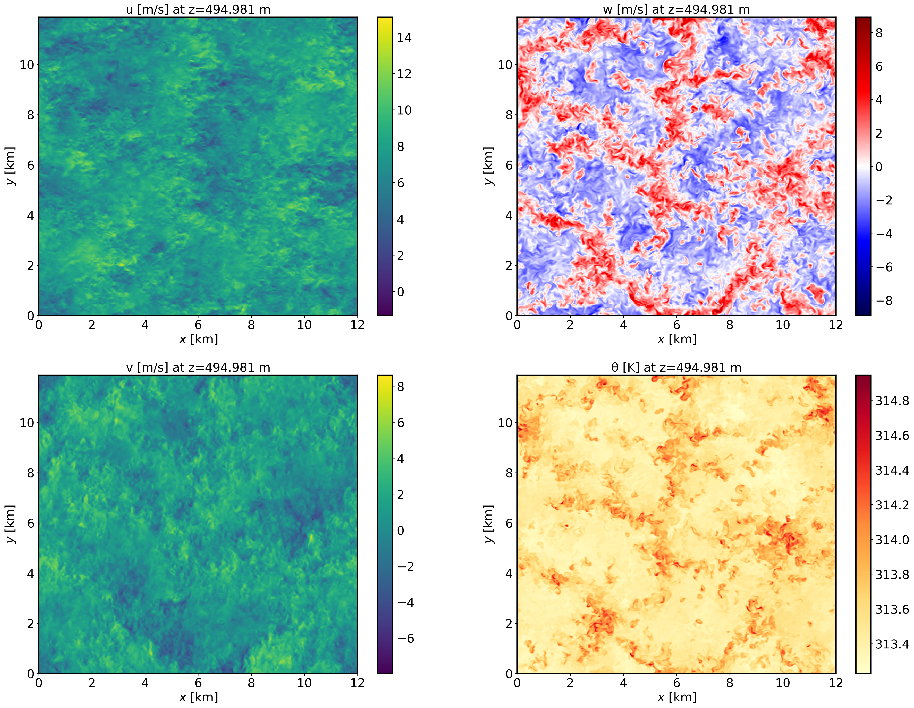
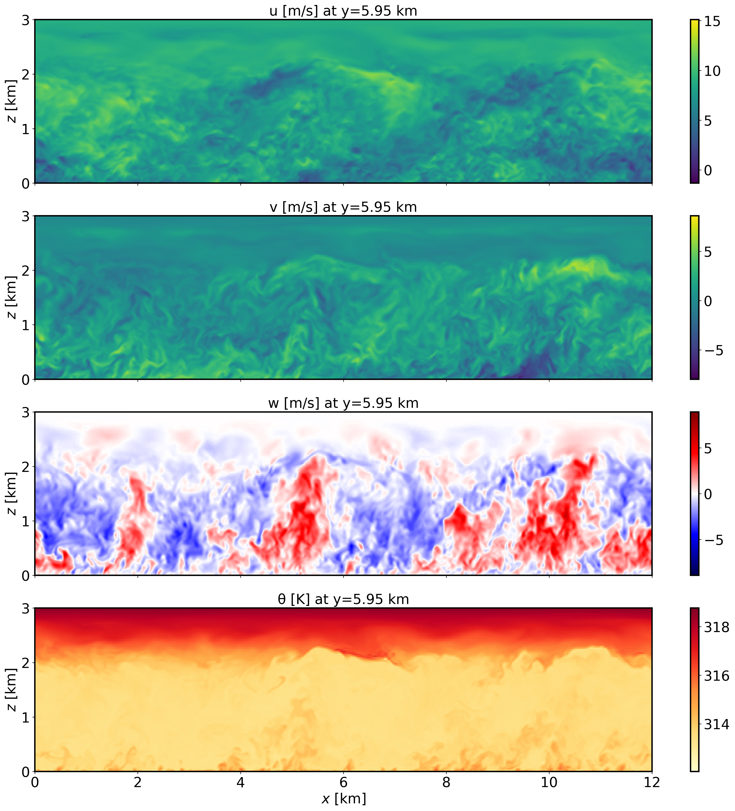
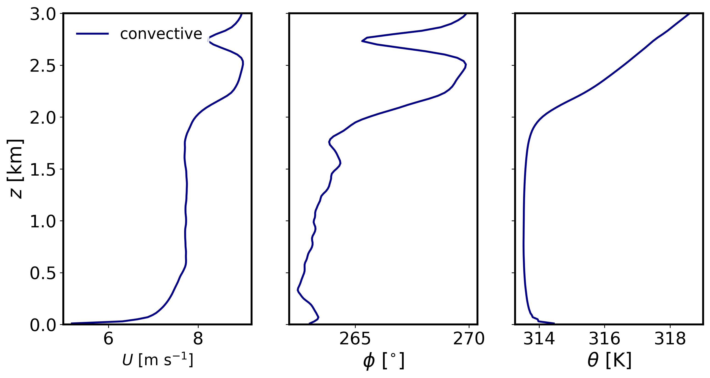
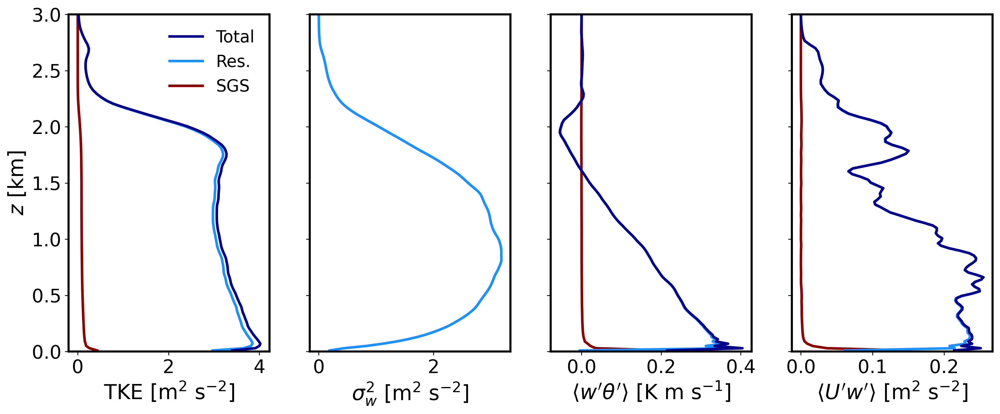

Dry convective boundary layer
================================

This is the convective boundary layer scenario described by Sauer and Munoz-Esparza (2020). This case represents the boundary layer conditions at the SWiFT facility near Lubbock, Texas at 4 July 2012 during the period of 18Z-20Z (12:00–14:00 local time), the strongest period of convection on the day.

Input parameters
----------------

* Number of grid points: :math:`[N_x,N_y,N_z]=[600,594,122]`
* Isotropic grid spacings in the horizontal directions: :math:`[dx,dy]=[20,20]` m, vertical grid is :math:`dz=20` m at the surface and stretched with verticalDeformFactor :math:`=0.80`
* Domain size: :math:`[12.0 \times 11.9 \times 3.0]` km
* Model time step: :math:`0.05` s
* Geostrophic wind: :math:`[U_g,V_g]=[9,0]` m/s
* Advection scheme: Hybrid 5th order upwind
* Time scheme: 3rd-order Runge Kutta
* Latitude: :math:`33.5^{\circ}` N
* Surface potential temperature: :math:`309` K
* Potential temperature profile:
.. math::
  \partial{\theta}/\partial z =
    \begin{cases}
      0 & \text{if $z$ $\le$ 600 m}\\
      0.004 & \text{if $z$ > 600 m}
    \end{cases}
* Surface heat flux:  :math:`0.35` Km/s
* Surface roughness length: :math:`z_0=0.05` m
* Rayleigh damping layer: uppermost :math:`400` m of the domain
* Initial perturbations: :math:`\pm 0.25` K 
* Depth of perturbations: :math:`400` m
* Top boundary condition: free slip
* Lateral boundary conditions: periodic
* Time period: :math:`4` h

Execute FastEddy
----------------

Run FastEddy using the input parameters file /examples/Example02_CBL.in. To execute FastEddy, follow the instructions here: https://github.com/NCAR/FastEddy-model/blob/main/README.md.

Visualize the output
--------------------

Open the Jupyter notebook entitled "MAKE_FE_TUTORIAL_PLOTS.ipynb" and execute it using setting: case = 'convective'.

XY-plane views of instantaneous velocity components at :math:`t=4` h (FE_CBL.288000):

  
XZ-plane views of instantaneous velocity components at :math:`t=4` h (FE_CBL.288000):

  
Mean (domain horizontal average) vertical profiles of state variables at :math:`t=4` h (FE_CBL.288000):

  
Horizontally-averaged vertical profiles of turbulence quantities :math:`t=3-4` h [perturbations are computed at each point relative to the previous 1-hour mean, and then horizontally averaged]:

Analyze the output
------------------

* Using the XY and XZ cross sections, discuss the characteristics (scale and magnitude) of the resolved turbulence.
* What is the boundary layer height in the convective case?
* Using the vertical profile plots, explain why the boundary layer is unstable.
