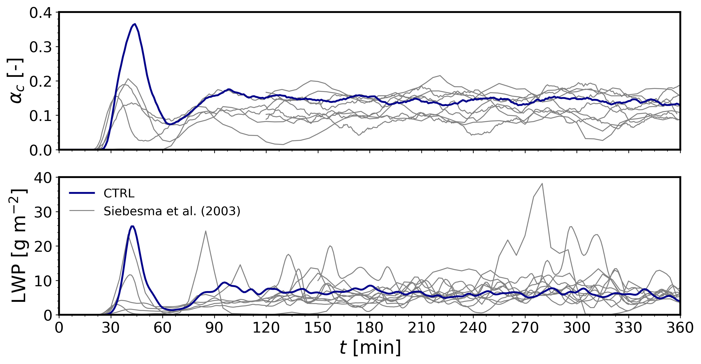
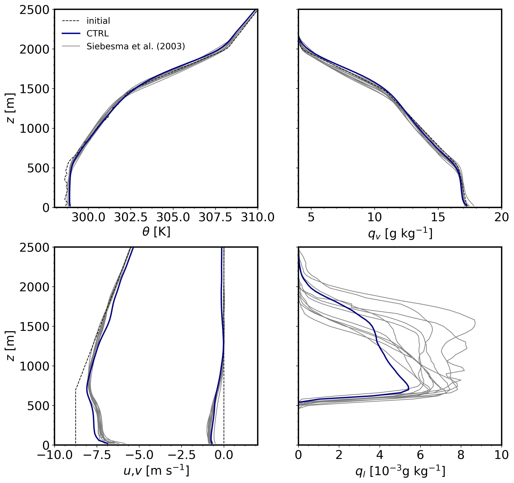
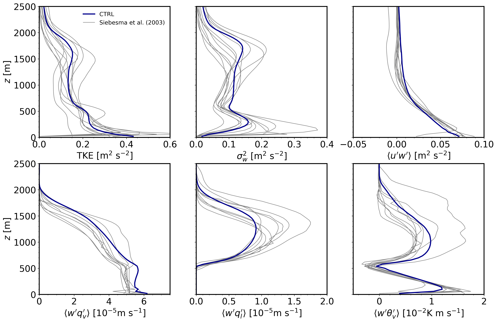

Moist cloud-topped boundary layer
=================================

This tutorial case is the BOMEX LES intercomparison study from Siebesma et al. (2003), corresponding to a non-precipitating shallow cumulus cloud case informed by the Barbados Oceanographic and Meteorological Experiment (BOMEX, Holland & Rasmusson, 1973). The forcing consists of two different sources including prescribed kinematic surface fluxes of sensible and latent heat and large-scale forcing (LSF) tendencies due to mesoscale horizontal advection of water vapor mixing ratio, liquid potential temperature and horizontal momentum. The LSF includes subsidence to compensate the integrated effect of surface fluxes and advection tendencies, formulated as a prescribed time-invariant subsidence profile multiplied by the vertical gradient of horizontally averaged fields accros the domain. The main settings of this case are listed below and are further detailed in Munoz-Esparza et al. (2022).

Input parameters
----------------

* Number of grid points: :math:`[N_x,N_y,N_z]=[152,146,122]`
* Isotropic grid spacings: :math:`[dx,dy,dz]=[100,100,40]` m
* Domain size: :math:`[15.2 \times 14.6 \times 4.9]` km
* Model time step: :math:`0.075` s
* Geostrophic wind: :math:`[U_g,V_g]=[10,0]` m :math:`\mbox{s}^{-1}`
* Advection schemes: 5th-order upwind (dry dynamics), 3rd-order upwind (water vapor), and 3rd-order WENO (liquid water)
* Time scheme: 3rd-order Runge Kutta
* Latitude: :math:`14.94^{\circ}` N
* Surface potential temperature: :math:`299.1` K
* Surface sensible heat flux: :math:`8 \times 10^{-3}` K m :math:`\mbox{s}^{-1}`
* Surface latent heat flux: :math:`5.2 \times 10^{-5}` m :math:`\mbox{s}^{-1}`
* Surface roughness length: :math:`z_0=0.0002` m
* Rayleigh damping layer: uppermost :math:`500` m of the domain
* Initial perturbations: :math:`\pm 0.1` K
* Depth of perturbations: :math:`1600` m
* Top boundary condition: free slip
* Lateral boundary conditions: periodic
* Time period: :math:`6` h
* Initital conditions: vertical profiles of :math:`u`, :math:`q_v`, and SGSTKE as specified in Siebesma et al. (2003)
* Large-scale forcings: vertical profiles of subsidence and horizontal advection of potential temperature and water vapor as specified in Siebesma et al. (2003)

Execute FastEddy
----------------

Run FastEddy using the input parameters file /examples/Example04_BOMEX.in. Note that the BOMEX case requires an initial condition provided in /datasets/BOMEX_IC/FE_BOMEX.0. To execute FastEddy, follow the instructions here: https://github.com/NCAR/FastEddy-model/blob/main/README.md.

Visualize the output
--------------------

Open the Jupyter notebook entitled "FE_Postrocessing_Example04_BOMEX.ipynb" and execute it.

Time evolution of domain averaged total cloud cover (:math:`\alpha_c`) and liquid water path (LWP):

Vertical profiles of potential temperature (:math:`\theta`), water vapor (:math:`q_v`), horizontal velocity components (:math:`u`, :math:`v`), and liquid content (:math:`q_l`). Thin black dashed lines correspond to the initial conditions. Profiles are averaged for the last 3 hr (:math:`t = 180-360` min) and over horizontal domain slabs:

Vertical profiles of turbulence kinetic energy (TKE), vertical velocity variance (:math:`\sigma^2_w`), and vertical turbulent fluxes of zonal momentum (:math:`\langle u'w' \rangle`), water vapor (:math:`\langle w'q_v' \rangle`), liquid cloud, and virtual potential temperature (:math:`\langle w'q_l' \rangle`). Profiles are averaged for the last 3 hr (:math:`t = 180–360` min) and perturbations are computed as the departure from horizontal slab averages. These turbulence quantities are the sum of resolved and subgrid-scale components.

Analyze the output
------------------

* Using the time series of cloud properties, could you identify when the simulated shallow cumulus cloud deck has reached quasi-eqilibrium?
* What is the effect of boundary-layer turbulence to the mean profiles of momentum?
* Identify the vertical extent of the cloud layer.
* Which of the turbulent vertical transport terms is responsible for the resulting vertical liquid cloud distribution?
