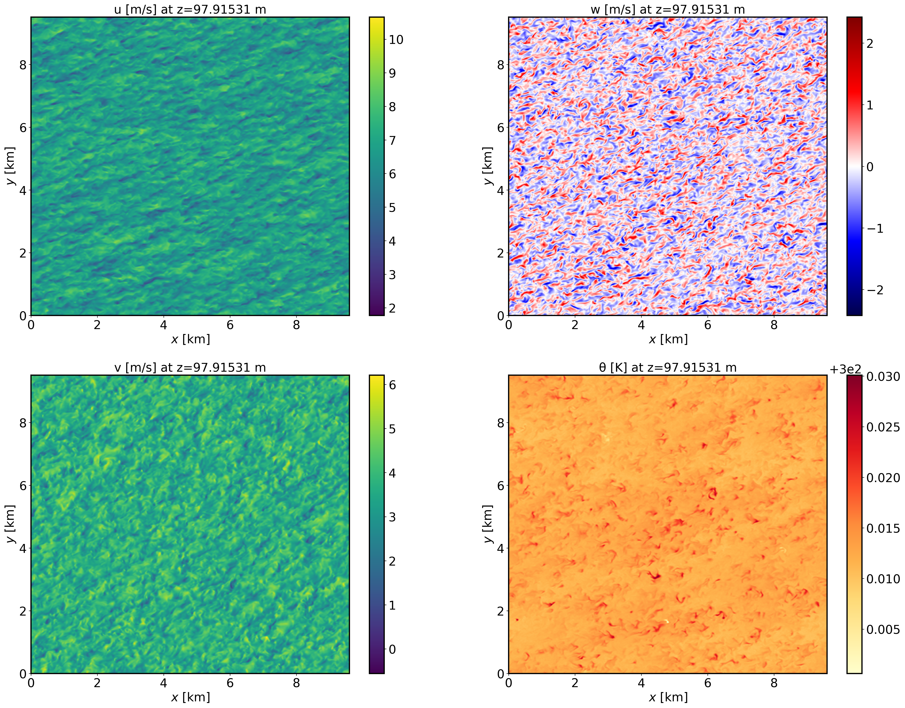
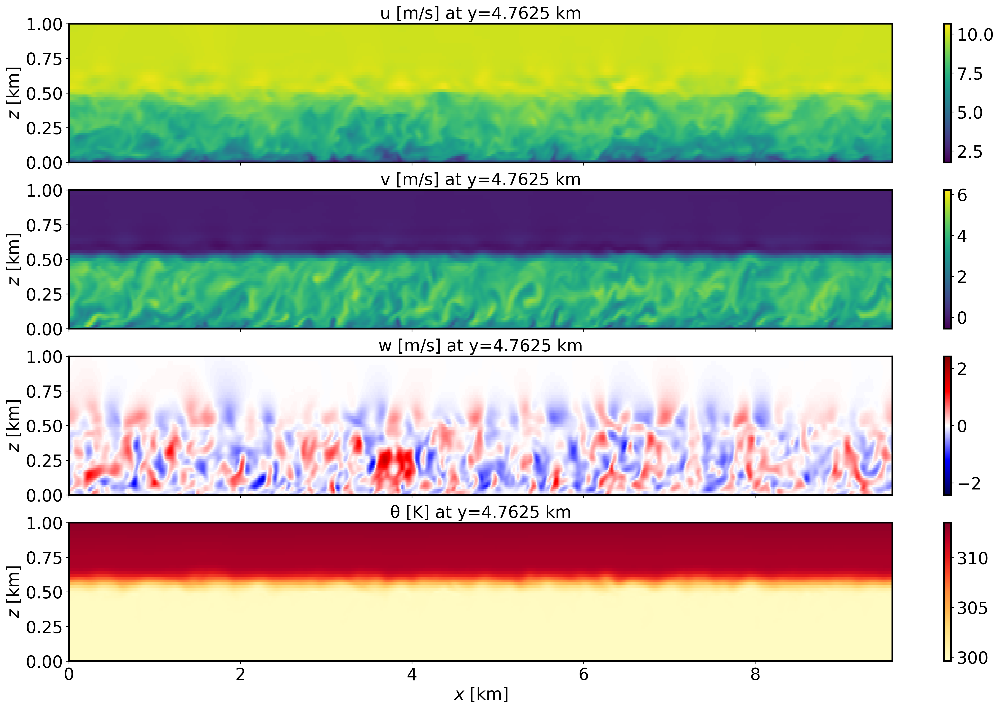
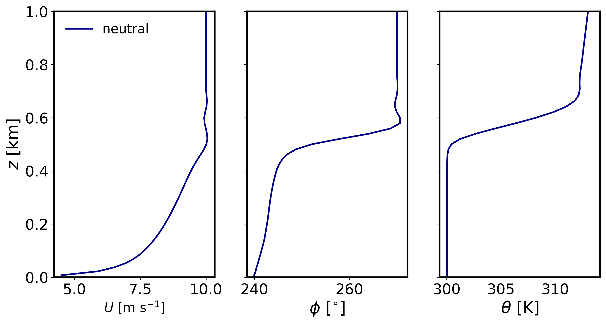
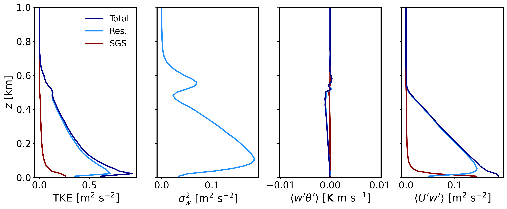

Dry neutral boundary layer
===========================

Background
----------

This is a canonical neutral boundary layer scenario. The case is broadly based upon Sauer and Munoz-Esparza (2020) but is not identical. A geostrophic wind is prescribed over ground with a set aerodynamic roughness length under a neutrally stratified boundary layer. The purpose of this test case is to visualize and analyze the resultant flow and turbulence characteristics that develop when the LES reaches statistical steady-state.

Input parameters
----------------

* Number of grid points: :math:`[N_x,N_y,N_z]=[640,634,58]`
* Isotropic grid spacings in the horizontal directions: :math:`[dx,dy]=[15,15]` m, vertical grid is :math:`dz=15` m at the surface and stretched with verticalDeformFactor :math:`=0.75`
* Domain size: :math:`[9.6 \times 9.51 \times 1.08]` km
* Model time step: :math:`0.04` s
* Advection scheme: 5th-order upwind
* Time scheme: 3rd-order Runge Kutta
* Geostrophic wind: :math:`[U_g,V_g]=[10,0]` m/s
* Latitude: :math:`54.0^{\circ}` N
* Surface potential temperature: :math:`300` K
* Potential temperature profile:
.. math::
  \partial{\theta}/\partial z =
    \begin{cases}
      0 & \text{if $z$ $\le$ 500 m}\\
      0.08 & \text{if 500 m < $z$ $\le$ 650 m}\\
      0.003 & \text{if $z$ > 650 m}
    \end{cases} 
* Surface heat flux:  :math:`0.0` Km/s
* Surface roughness length: :math:`z_0=0.1` m
* Rayleigh damping layer: uppermost :math:`400` m of the domain
* Initial perturbations: :math:`\pm 0.25` K 
* Depth of perturbations: :math:`375` m
* Top boundary condition: free slip
* Lateral boundary conditions: periodic
* Time period: :math:`7` h

Execute FastEddy
----------------

Run FastEddy using the input parameters file /examples/Example01_NBL.in. To execute FastEddy, follow the instructions here: https://github.com/NCAR/FastEddy-model/blob/main/README.md.

Visualize the output
--------------------

Open the Jupyter notebook entitled "MAKE_FE_TUTORIAL_PLOTS.ipynb" and execute it using setting: case = 'neutral'.

XY-plane views of instantaneous velocity components at :math:`t=7` h (FE_NBL.630000):

  
XZ-plane views of instantaneous velocity components at :math:`t=7` h (FE_NBL.630000):

  
Mean (domain horizontal average) vertical profiles of state variables at :math:`t=7` h (FE_NBL.630000):

 
Horizontally-averaged vertical profiles of turbulence quantities at :math:`t=6-7` h [perturbations are computed at each time instance from horizontal-slab means, then averaged horitontally and over the previous 1-hour mean]:

Analyze the output
------------------

* Using the XY and XZ cross sections, discuss the characteristics (scale and magnitude) of the resolved turbulence.
* What is the boundary layer height in the neutral case?
* Using the vertical profile plots, explain why the boundary layer is neutral.

