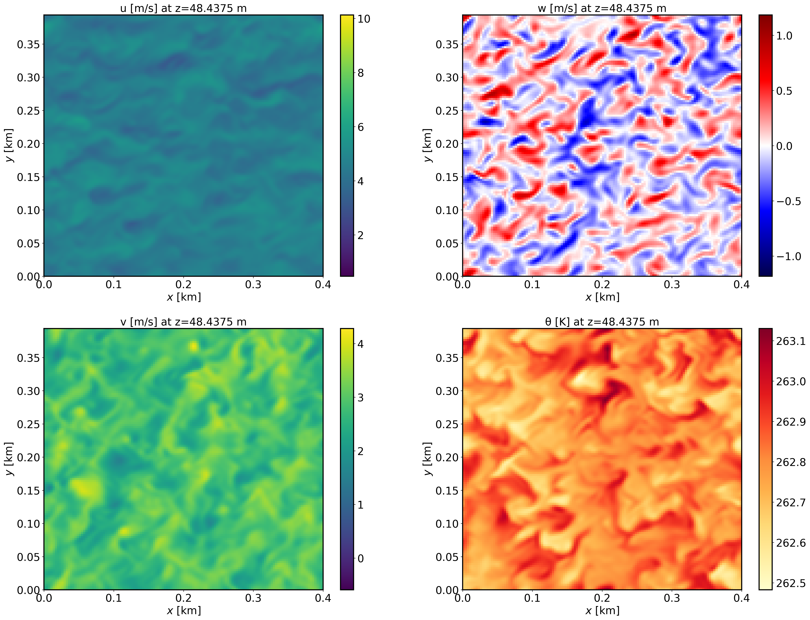
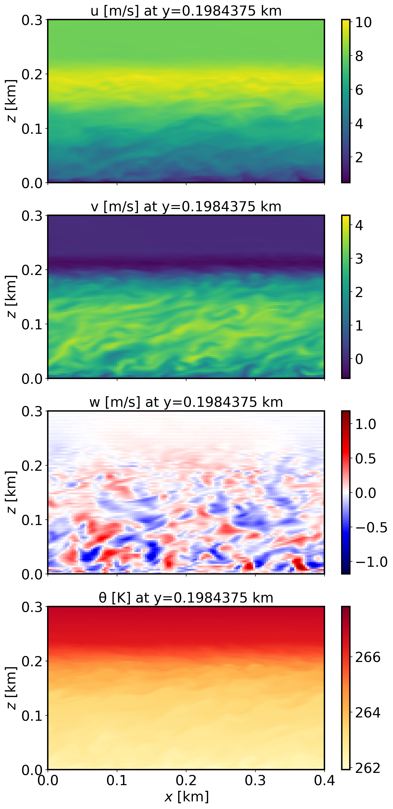
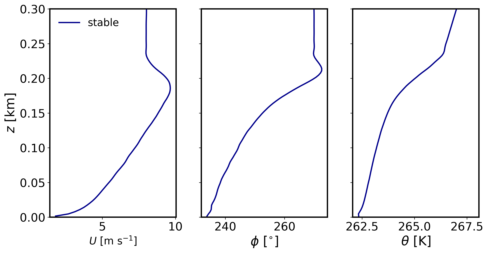
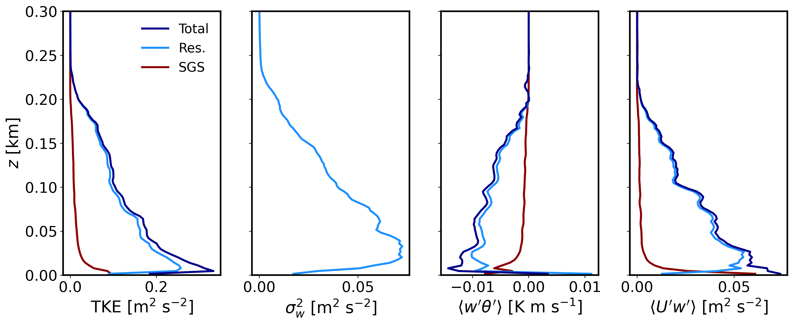

Dry stable boundary layer
==========================

Background
------------------

This is the stable boundary layer scenario described by Sauer and Munoz-Esparza (2020). This the stable boundary layer scenario outlined in Kosovic and Curry (2000).

Input parameters
----------------

* Number of grid points: :math:`[N_x,N_y,N_z]=[128,126,122]`
* Isotropic grid spacings: :math:`[dx,dy,dz]=[3.125,3.125,3.125]` m
* Domain size: :math:`[0.40 \times 0.39 \times 0.38]` km
* Model time step: :math:`0.005` s
* Geostrophic wind: :math:`[U_g,V_g]=[8,0]` m/s
* Advection scheme: 5th-order upwind
* Time scheme: 3rd-order Runge Kutta
* Latitude: :math:`73^{\circ}` N
* Surface potential temperature: :math:`265` K
* Potential temperature profile:
.. math::
  \partial{\theta}/\partial z =
    \begin{cases}
      0 & \text{if $z$ $\le$ 100 m}\\
      0.01 & \text{if $z$ > 100 m}
    \end{cases}   
* Surface heat flux:  :math:`-0.25` K/h
* Surface roughness length: :math:`z_0=0.1` m
* Rayleigh damping layer: uppermost :math:`75` m of the domain
* Initial perturbations: :math:`\pm 0.25` K 
* Top boundary condition: free slip
* Lateral boundary conditions: periodic
* Time period: :math:`12` h

Execute FastEddy
----------------

Run FastEddy using the input parameters file /examples/Example03_SBL.in. To execute FastEddy, follow the instructions here: https://github.com/NCAR/FastEddy-model/blob/main/README.md.

Visualize the output
--------------------

Open the Jupyter notebook entitled "MAKE_FE_TUTORIAL_PLOTS.ipynb" and execute it using setting: case = 'stable'.

XY-plane views of instantaneous velocity components at :math:`t=12` h (FE_SBL.8640000):

  
XZ-plane views of instantaneous velocity components at :math:`t=12` h (FE_SBL.8640000):

  
Mean (domain horizontal average) vertical profiles of state variables at :math:`t=12` h (FE_SBL.8640000):

  
Horizontally-averaged vertical profiles of turbulence quantities at :math:`t=11-12` h (FE_TEST.8640000) [perturbations are computed at each point relative to the previous 1-hour mean, and then horizontally averaged]:

Analyze the output
------------------

* Using the XY and XZ cross sections, discuss the characteristics (scale and magnitude) of the resolved turbulence.
* What is the boundary layer height in the stable case?
* Using the vertical profile plots, explain why the boundary layer is stable.
