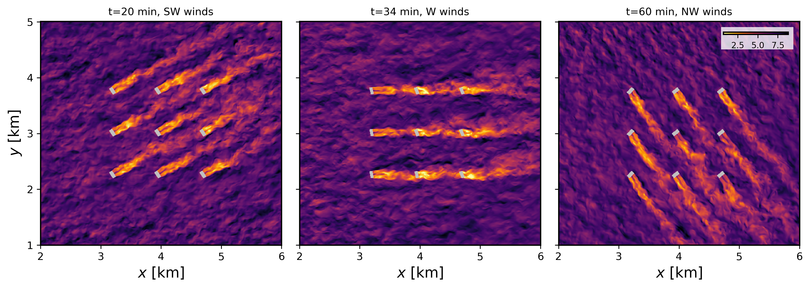

==========================================================
Flow in the presence of a turbine array under a wind shift
==========================================================

This is an idealized scenario of wind farm (3 x 3 turbine array) flow in neutrally stratified boundary layer undergoing a change in wind direction of 90 degrees over 40 minutes. This idealized scenario demonstrates the generalized actuator disk (GAD) implementation in FastEddy (*Sanchez Gomez et al., 2024* [#f1]_), with the inclusion of a turbine yawing capability to align with the meteorological wind direction at the turbine's nacelle. The initial and boundary conditions for this idealized case are derived from a horizontally averaged LES run of a neutral ABL with a geostrophic wind aligned in the zonal direction (:math:`[U_g,V_g]=[10.0,0.0]` m/s) with and a latitude of :math:`40.0^{\circ}` N. The required datasets to run this tutorial are provided at this Zenodo record [TO BE UPDATED].

In order to activate the GAD model, the corresponding selector needs to be turned on (:code:`GADSelector = 1`) in the parameters file. The lines below correspond to additions and modifications to the FastEddy parameters file necessary for turbine-inclusive LES runs (corresponding to the test case from **tutorials/examples/Example09_GAD.in**), particularly for the case when the turbine forces are added to the model's output.

.. code-block:: none

   #--GAD
   GADSelector = 1
   turbineSpecsFile = ./GAD_NREL28_9WTs_tutorial.nc
   GADoutputForces = 1

A key aspect required for the GAD model to work is the specification of the aerodynamic characteristics of the simulated turbine. These are included in a netCDF file, together with geometrical characteristics of the wind turbine (rotor diameter: :code:`GAD_rotorD`, turbine hub height: :code:`GAD_hubHeights`, nacelle diameter: :code:`GAD_nacelleD`) and the initial location and orientation of the turbines (:code:`GAD_Xcoords`, :code:`GAD_Ycoords`, :code:`GAD_rotorTheta`). Polynomial fits for lift and drag coefficient, twist, chord length, blade pitch, and rotational speed are utilized, discretized over a finite number of normalized blade elements (:code:`rnorm_vect`), required by the blade-element momentum theory used in the GAD formulation. For flexibility purposes, an arbitrary number of turbines can be defined (:code:`GAD_turbineType`). This tutorial provides an example turbine specification file corresponding to NREL28's turbine (**GAD_NREL28_9WTs_tutorial.nc**). All the required variables and dimensions in the turbine specifications file are listed here below.

.. code-block:: none

   float GAD_Xcoords(GADNumTurbines) ;
   float GAD_Ycoords(GADNumTurbines) ;
   float GAD_rotorTheta(GADNumTurbines) ;
   int GAD_turbineType(GADNumTurbines) ;
   int GADNumTurbineTypes(GADNumTurbineTypes) ;
   int turbinePolyClCdrNormBounds(turbinePolyClCdrNormBounds) ;
   int turbinePolyClCdrNormSegments(turbinePolyClCdrNormSegments) ;
   int alphaBounds(alphaBounds) ;
   int turbinePolyOrderMax(turbinePolyOrderMax) ;
   float GAD_hubHeights(GADNumTurbineTypes) ;
   float GAD_rotorD(GADNumTurbineTypes) ;
   float GAD_nacelleD(GADNumTurbineTypes) ;
   float rnorm_vect(GADNumTurbineTypes, turbinePolyClCdrNormBounds) ;
   float alpha_minmax_vect(GADNumTurbineTypes, alphaBounds) ;
   float turbinePolyTwist(GADNumTurbineTypes, turbinePolyOrderMax) ;
   float turbinePolyChord(GADNumTurbineTypes, turbinePolyOrderMax) ;
   float turbinePolyPitch(GADNumTurbineTypes, turbinePolyOrderMax) ;
   float turbinePolyOmega(GADNumTurbineTypes, turbinePolyOrderMax) ;
   float turbinePolyCl(GADNumTurbineTypes, turbinePolyClCdrNormSegments, turbinePolyOrderMax) ;
   float turbinePolyCd(GADNumTurbineTypes, turbinePolyClCdrNormSegments, turbinePolyOrderMax) ;
   int turbinePolyTwistOrder(GADNumTurbineTypes) ;
   int turbinePolyChordOrder(GADNumTurbineTypes) ;
   int turbinePolyPitchOrder(GADNumTurbineTypes) ;
   int turbinePolyOmegaOrder(GADNumTurbineTypes) ;
   int turbinePolyClOrder(GADNumTurbineTypes) ;
   int turbinePolyCdOrder(GADNumTurbineTypes) ;

The figure shows instantaneous contours of hub height (90 m) wind speed (in m/s) spatial distribution at three different times, showcasing the yawing of the turbines to align with the time-varying wind direction throughout the course of the simulation as it shifts from SW to NW. The gray areas represent the location over which GAD forces are applied (larger than the actual rotor area).

.. note::

   * The orientation of the turbine (:code:`GAD_rotorTheta`) is defined as the angle from the negative x axis, increasing counterclockwise. This is different from the meteorological convention for wind direction. For example, a turbine facing the west will have :code:`GAD_rotorTheta` = :math:`0.0^{\circ}`, while a turbine facing south will have :code:`GAD_rotorTheta` = :math:`90.0^{\circ}`.
   * Application of the GAD to a real world WRF-coupled simulation does not require any additional steps besides the ones described here.

.. rubric:: References

.. [#f1] Sanchez Gomez, M., Muñoz-Esparza, D. & Sauer, J.A. (2024). Implementation and Validation of a Generalized Actuator Disk Parameterization for Wind Turbine Simulations Within the FastEddy Model. Wind Energy, 27(11), 1353-1368.
