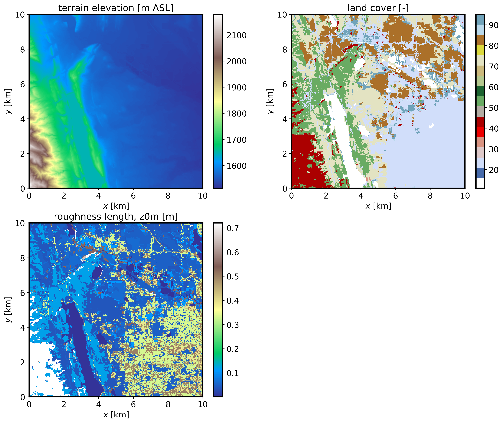

=============================================
Setting up a real-world downscaled simulation
=============================================

Background
----------

This is an example of a dynamically downscaled FastEddy simulation over Fort Collins (CO) driven by WRF mesoscale weahter. This tutorial introduces the 3 preprocessing steps required to run mesoscale coupled real cases: GeoSpec, SimGrid, and GenICBCs, all of which are implemented using python scripts. The required datasets to run this tutorial are provided at this `Zenodo record <https://zenodo.org/records/Blahblah>`_.

GeoSpec.py
----------
The first preprocessing step is **GeoSpec**. The purpose of this step is to create a netCDF file of standard format that allows ingestion of the required GIS data into FastEddy later on. The following variable dimensions and naming convention is required for *GeoSpec.py* to execute properly.

.. literalinclude:: ./variables_GISinput

The two required fields are the terrain topography (:code:`topoPos`, in m above seal level) and the categorical land cover (:code:`LandCover`). Note that high-resolution fields are desirable as inputs, and that both need to have the same resolution (:code:`cellsize`, in m). Terrain can usually be obtained from lidar data at a few meters resolution, while land cover datasets are typically coarser. For U.S. locations we recommend using NLCD dataset, which provides a high resolution of 30 m. These fields need to come together with corresponding latitude and longitude 2d fileds (:code:`lat` and :code:`lon`), provided with double precision due to the high-resolution typically used in these FastEddy simulations.

Input parameters to **GeoSpec.py** are provided by the **geospec.json** file. These include the path and file name of the input GIS data (*gis_root* and *gis_file*, respectively), together with other parameters like the output path of the output netCDF file of standard formant (*FE_dataset_path*). In order to convert the land cover class into a roughness length value, a look-up table has to be provided (*nlcd_name*). In this tutorial is based on the 16-class NLCD dataset (:code:`LandCoverMetadata.csv`). The json file entry *water_cats* needs to list all of the land cover categories that correspond to water bodies, so an appropriate roughness length parameterization can be used by FastEddy. Once all the required input files are ready, **GeoSpec.py** can be executed:

.. code-block::
   
  python ./GeoSpec.py -f geospec.json

After successful completion of the python code, a netCDF file (:code:`FortCollinsCO.nc`) with the following fields will be created:

.. literalinclude:: ./variables_GeoSpec

If the json file option *save_plot_opt* is set to 1, then a plot will be produced displaying the terrain elevation, land cover, and roughness length maps.

.. note::

   * All of the three preprocessing steps make use of functions defined in *couplingUtils.py*, so this file needs to be placed in the folder where the preprocessing python codes are executed or alternatively incorporate the path where *couplingUtils.py* is located to the list of directories for python to look into (using *sys.path.append*).
   * Alternatively to providing a GIS file, the user can point to a WRF restart file as the source of GIS information (:code"`gis_opt = 1`). A WRF output file can also be used, but it needs to include the variable *ZNT* (roughness length) not present by default in WRF output files.

SimGrid.py
----------
The second preprocessing step is **SimGrid**. The purpose of this step is to set up a FastEddy grid utilizing over a domain located within the area covered by the GIS file generated with *GeoSpec*. The location of the center of the FastEddy domain is specified by the **simgrid.json** file parameters *center_lat* and *center_lon*. The number of points in each directions (:code:`Nx`,:code:`Ny`,:code:`Nz`), grid spacings (:code:`d_xi`,:code:`d_eta`,:code:`d_zeta`), and vertical stretching parameters (:code:`verticalDeformFactor`,:code:`verticalDeformQuadCoeff`) required to set up a grid are read in from a FastEddy parameters file (*FE_params_file*).
