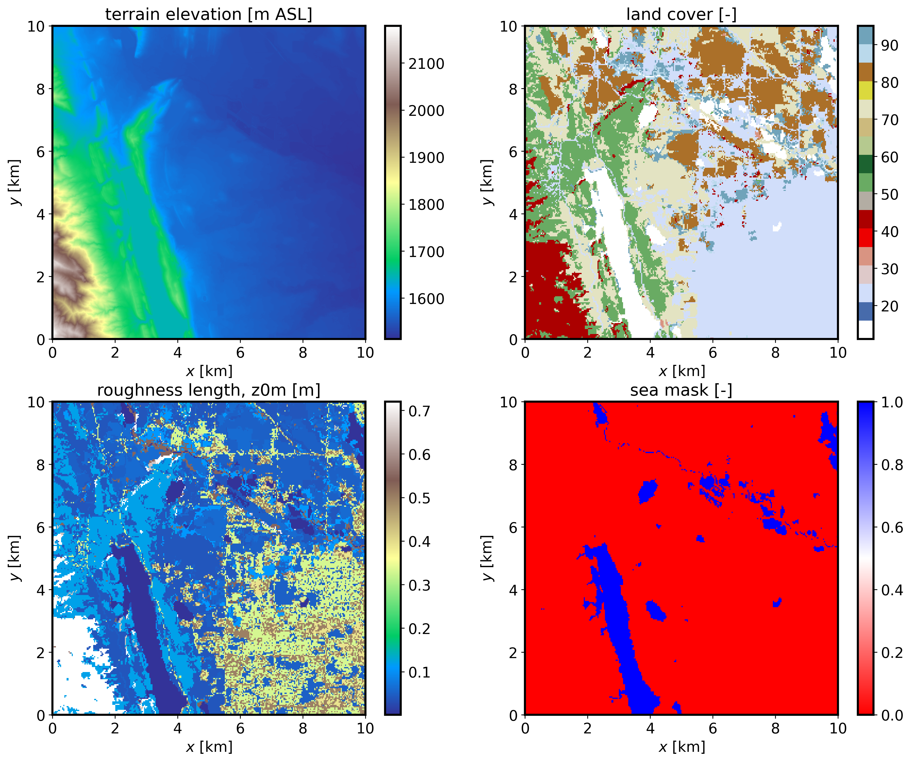
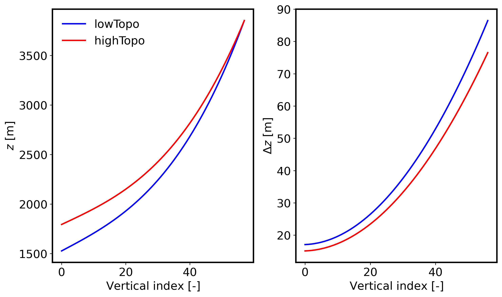

=============================================
Setting up a real-world downscaled simulation
=============================================

This is an example of a dynamically downscaled FastEddy simulation over Fort Collins (CO) driven by WRF mesoscale weather. This tutorial introduces the 3 preprocessing steps required to run mesoscale coupled real cases: GeoSpec, SimGrid, and GenICBCs, all of which are implemented using python scripts (**scripts/python_utilities/coupler/**). The required datasets to run this tutorial are provided at this `Zenodo record <https://zenodo.org/records/Blahblah>`_.

GeoSpec
-------
The first preprocessing step is **GeoSpec.py**. The purpose of this step is to create a netCDF file of standard format that allows ingestion of the required GIS data into a gridded FastEddy domain later on. The following variable dimensions and naming convention of the input netCDF file is required for *GeoSpec.py* to execute properly (see provided example input netCDF file: :code:`ftCollins_inputs_gis.nc`).

.. code-block:: none

   float x(x) ;
   float y(y) ;
   float topoPos(y, x) ;
   double lat(y, x) ;
   double lon(y, x) ;
   int LandCover(y, x) ;
   float cellsize ;

The two required fields are the terrain topography (:code:`topoPos`, in m above seal level) and the categorical land cover (:code:`LandCover`). Note that high-resolution fields are desirable as inputs, and that both fields need to have the same resolution (:code:`cellsize`, in m). Terrain can usually be obtained from lidar data at a few meters resolution, while land cover datasets are typically coarser. For U.S. locations we recommend using NLCD dataset that comes at a high resolution of 30 m. These fields need to come together with the corresponding latitude and longitude 2d fileds (:code:`lat` and :code:`lon`) provided with double precision due to the high-resolution typically used in these FastEddy simulations.

Input parameters to **GeoSpec.py** are specified in the **geospec.json** file. These include the path and file name of the input GIS data (*gis_root* and *gis_file*, respectively), together with other parameters like the output path of the output netCDF file of standard formant (*FE_dataset_path*). In order to convert the land cover class into a roughness length value, a look-up table has to be provided (*nlcd_name*). In this tutorial is based on the 16-class NLCD dataset (:code:`LandCoverMetadata_NLCD16.csv`). The json file entry *water_cats* needs to list all of the land cover categories that correspond to water bodies, so an appropriate roughness length parameterization can be used by FastEddy. Once all the required input files are ready, **GeoSpec.py** can be executed:

.. code-block:: none

   python ./GeoSpec.py -f geospec.json

After successful completion of the python code, a netCDF file (:code:`FortCollinsCO.nc`) with the following fields will be created:

.. code-block:: none

   float xPos2d(yIndex, xIndex) ;
   float yPos2d(yIndex, xIndex) ;
   float topoPos(yIndex, xIndex) ;
   int LandCover(yIndex, xIndex) ;
   float z0m(yIndex, xIndex) ;
   float z0t(yIndex, xIndex) ;
   float SeaMask(yIndex, xIndex) ;
   float dx_inter ;
   float dy_inter ;
   double lat(yIndex, xIndex) ;
   double lon(yIndex, xIndex) ;

If the json file option *save_plot_opt* is set to 1, then a plot will be produced displaying the terrain elevation, land cover, and roughness length maps.

.. note::

   * All of the three preprocessing steps make use of functions defined in *couplingUtils.py*, so this file needs to be placed in the folder where the preprocessing python codes are executed or alternatively incorporate the path where *couplingUtils.py* is located to the list of directories for python to look into (using *sys.path.append*).
   * The input GIS data needs to be in the same projection than the WRF mesoscale data that will be used to provide initial and boundary conditions.
   * Alternatively to providing a GIS file, the user can point to a WRF restart file as the source of GIS information (:code:`gis_opt = 1`). A WRF output file can also be used, but it needs to include the variable *ZNT* (roughness length) not present by default in WRF output files.

SimGrid
-------
The second preprocessing step is **SimGrid.py**. The purpose of this step is to set up a FastEddy grid over a domain located within the area covered by the GIS file generated with *GeoSpec.py*. The location of the center of the FastEddy domain is specified in the **simgrid.json** file by the parameters *center_lat* and *center_lon*. The number of points in each directions (:code:`Nx`, :code:`Ny`, :code:`Nz`), grid spacings (:code:`d_xi`, :code:`d_eta`, :code:`d_zeta`), and vertical stretching parameters (:code:`verticalDeformFactor`, :code:`verticalDeformQuadCoeff`) required to set up a grid are read in from a FastEddy parameters file (*FE_params_file*). *SimGrid.py* performs decimation or interpolation between the GIS file resolution and the grid spacing of the target FastEddy domain for surface fields, in addition to creating the vertical grid that incorporates compression effects originating from the presence of terrain. Once all the required input files are ready, **SimGrid.py** can be executed:

.. code-block:: none

   python ./SimGrid.py -f simgrid.json

After successful completion of the python code, a netCDF file (:code:`FortCollinsCO.0`) with the following fields will be created:

.. code-block:: none

   float xPos(zIndex, yIndex, xIndex) ;
   float yPos(zIndex, yIndex, xIndex) ;
   float zPos(zIndex, yIndex, xIndex) ;
   float topoPos(yIndex, xIndex) ;
   float z0m(yIndex, xIndex) ;
   float z0t(yIndex, xIndex) ;
   float SeaMask(yIndex, xIndex) ;
   int LandCover(yIndex, xIndex) ;
   double lat(yIndex, xIndex) ;
   double lon(yIndex, xIndex) ;
   int xIndex(xIndex) ;
   int yIndex(yIndex) ;
   int zIndex(zIndex) ;

A binary file containing the terrain elevation information will also be generated (:code:`FortCollinsCO_Topography_448x450.dat`) and that needs to be pointed to in the :code:`topoFile` entry of FastEddy's parameters file. If the json file option *save_plot_opt* is set to 1, then a plot will be produced displaying the vertical distribution of height and grid spacing at the lowest and highest terrain elevation points in the domain: 

.. note::

   * Keep in mind that high elevation locations will feature additional grid compression, therefore resulting in the smallest surface grid spacings. You may need to adjust the vertical stretching parameters in the FastEddy input file and rerun *SimGrid.py* until the minimum desired surface grid spacing is achieved. The printouts generated during the execution of *SimGrid.py* can be useful for that purpose.
   * Remember to adjust FastEddy's timestep accordingly to the minimum grid spacing of the domain to avoid numerical instabilities.
   
GenICBCs
--------
The third preprocessing step is **GenICBCs.py**. The purpose of this step is to create initial and boundary conditions (ICBCs) from the mesoscale WRF simulation results over the gridded domain created by *SimGrid.py*. The input parameters are specified in the corresponding *genicbcs.json* file. This step involves three-dimensional interpolation of prognostic equation variables (winds, density, potential temperature and water vapor) and two-dimensional interpolation of surface skin forcings (temperature and water vapor). In order for WRF to provide the required fields to drive a nested FastEddy simulation, a number of additional variables not present in WRF's default output are required. To save the necessary variables at a sufficiently high temporal fidelity in an efficient manner, it is recommended to create WRF auxiliary files. For that purpose, when running WRF, include the following lines in WRF's namelist.input.

.. code-block:: none

   &time_control
   iofields_filename         = "vars_io.txt",
   ignore_iofields_warning   = .true.,
   auxhist14_outname         = "wrf_fasteddy_d<domain>_<date>",
   auxhist14_interval_m      = 5,
   frames_per_auxhist14      = 1,
   io_form_auxhist14         = 2

And include the file *vars_io.txt* containing the one line below in WRF's run directory.

.. code-block:: none

   +:h:14:PH,PHB,U,V,W,T,QVAPOR,QCLOUD,ALT,TSK,Q2,HGT,PSFC,XLAT,XLONG,Z0,ZNT

With these additions, WRF will generate a set of timestamped *wrf_fasteddy_* files that will be utilized as basis for the interpolation to the FastEddy grid. The rest of input parameters are meant to provide the starting date and time of the sequence of ICBCs to be created. Similarly to the other preprocessing python code, **GenICBCs.py** is executed as:

.. code-block:: none

   python ./GenICBCs.py -f genicbcs.json

Successful completion will create an initial condition file (*FE_interp_170000UTC.0*) and a set of boundary condition files (*FE_Bndys.**) where the index indicates the number of second increments from the initial time (frequency in seconds is specified by the parameter :code:`secInc` in *genicbcs.json*).
