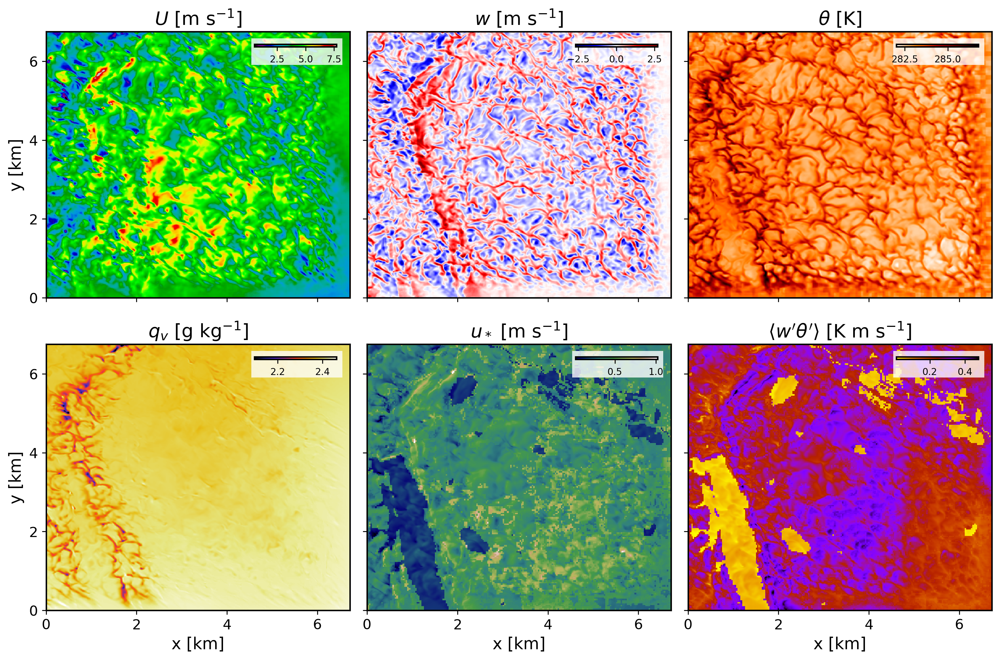

========================================================
Running a real-world downscaled simulation with FastEddy
========================================================

After initial and boundary conditions have been created, a FastEddy simulation can undertaken with intial and boundary forcing from the mesoscale prognostic state fields. The lines below correspond to additions and modifications to the FastEddy parameters file necessary for coupled mesoscale-LES runs (corresponding to the test case from **tutorials/examples/Example08_REALCASE_FortCollins.in**)

.. code-block:: none

   #--GRID
   topoFile = ./FortCollinsCO_Topography_448x450.dat
   #--Boundary Conditions Set
   hydroBCs = 1
   ceilingAdvectionBC = 1
   hydroBndysFileBase = ./ICBC/FE_Bndys
   hydroBndysFileStart = 0
   hydroBndysFileEnd = 16
   dtBdyPlaneBCs = 300.0

From the parameters above, :code:`hydroBCs = 1` is the main option to activate the time-dependent limited area domain boundary condition coupling to a mesoscale model. Note that :code:`dtBdyPlaneBCs` is the frequency in seconds for boundary conditions to update and that it needs to match the value of *secInc* specified in **genicbcs.json**. See :ref:`run_fasteddy` for instructions on how to build and run FastEddy on NSF NCAR’s High Performance Computing machines.

The figure below shows several instantaneous fields corresponding to a 1h and 25min hindcast valid at 1825 UTC on Februray 16th 2024. These horizontal contours are from the model's second vertical level, located at approximately 25 m above ground level.

