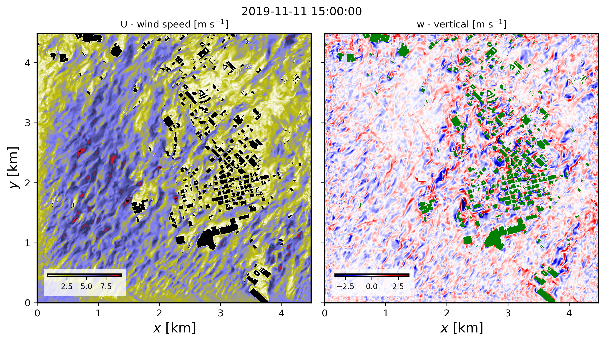

==========================================================================================
Setting up and running a real-world downscaled building-resolving simulation with FastEddy
==========================================================================================

The setting up of a real-world downscaled simulation that includes resolved buildings closely follows the same procedure as for a standard mesoscale coupling. The additional steps are described here below and all the required datasets to run this tutorial are provided at this Zenodo record [TO BE UPDATED].

In the *GeoSpec* preprocessing step, and additional 2d field describing building heights above ground level needs to be provided as part of the input NetCDF file.

.. code-block:: none

   float BuildingHeights(y, x) ;

This tutorial provides an example of building heights for downtown Dallas, TX (:code:`Dallas_input_Oct2025_lod13.nc`). Prior to the execution of **GeoSpec.py**, the *geospec.json* file option :code:`urban_opt : 1` needs to be selected for building height information to be ingested in the reference standard-format NetCDF output file.

The same :code:`urban_opt : 1` option needs to be included in the subsequent *SimGrid* and *GenICBCs*, so the building information leads to the creation of a :code:`BuildingMask` array containing gridded information of building presence, and ensuring that winds, subgrid-scale TKE and hydrometeors are zeroed out in the initial condition, respectively.

After initial and boundary conditions have been created, a building-resolving FastEddy simulation can be undertaken with initial and boundary forcing from the mesoscale prognostic state fields. The lines below correspond to additions and modifications to the FastEddy parameters file necessary to activate the urban model capability (corresponding to the test case from **tutorials/examples/Example10_REALCASE_Dallas_urban.in**)

.. code-block:: none

   #--URBAN
   urbanSelector = 1 # urban selector: 0=off, 1=on

The urban model capability has been implemented into FastEddy as an extension module, and is not compiled by default. The user needs to build FastEddy using the following compile flag below in order to include the GAD module:

.. code-block:: none

   make WITH_URBAN=1

The model used to represent buildings follows the immersed body force approach described in *Muñoz-Esparza et al., 2020* [#f1]_, and the tutorial case corresponds to the passage of a cold front (*Muñoz-Esparza et al.* (2021 [#f2]_, 2025 [#f3]_). The figure below shows instantaneous wind speed and vertical velocity fields corresponding to 30min hindcast valid at 1500 UTC on November 11th 2011 (pre-frontal conditions). These horizontal contours are from the model's third vertical level, located at approximately 23 m above ground level.

.. rubric:: References

.. [#f1] Muñoz-Esparza, D., Sauer, J.A., et al (2020). Inclusion of Building-Resolving Capabilities Into the FastEddy® GPU-LES Model Using an Immersed Body ForceMethod. Journal of Advances in Modeling Earth Systems, 12(11), e2020MS002141.

.. [#f2] Muñoz-Esparza, D., Shin, H.H, Sauer, J.A, et al. (2021). Efficient Graphics Processing Unit Modeling of Street-Scale Weather Effects in Support of Aerial Operations in the Urban Environment. AGU Advances, 2(2), e2021AV000432.

.. [#f3] Muñoz-Esparza, D., Sauer, J.A, Jiménez, P.A., Boehnert, J. , Hahn, D., Steiner, M. (2025). Multiscale weather forecasting sensitivities to urban characteristics and atmospheric conditions during a cold front passage over the Dallas-Fort Worth metroplex. Urban Climate, 60, 102334.
