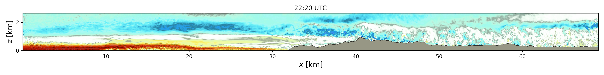

==================
FastEddy\ :sup:`®`
==================

FastEddy\ :sup:`®` (FE) is a large-eddy simulation (LES) model developed by the
Research Applications Laboratory (RAL) at the U.S. National Science
Foundation National Center for Atmospheric Research (NSF NCAR) in Boulder,
Colorado, USA. The fundamental premise of FastEddy model development is to
leverage the accelerated and more power efficient computing capacity of
graphics processing units (GPU)s to enable not only more widespread use of
LES in research activities but also to pursue the adoption of microscale
and multiscale, turbulence-resolving, atmospheric boundary layer
modeling into local scale weather prediction or actionable science and
engineering applications.

The FastEddy code is located in an open, public
`GitHub FastEddy-model repository <https://github.com/NCAR/FastEddy-model>`_.
All versions of the FastEddy software can be cited by using the
Digital Object Identifier (DOI):
https://zenodo.org/doi/10.5281/zenodo.11042754.
This DOI represents all versions and will always resolve to the latest one.

.. toctree::
   :hidden:

   release_notes.rst
   run_ncar_hpcs.rst
   downloads.rst
   Tutorial/index
   publications.rst
